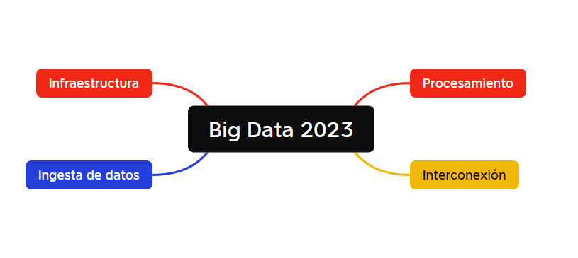

# 01. Curso de Especialización en Big Data e Inteligencia Artificial

El curso de especialización en big data e inteligencia artificial es una formación oficial de 600 horas que te capacitará para integrar sistemas de explotación de grandes volúmenes de datos aplicando soluciones de big data, implantar las funcionalidades, procesos y sistemas de decisiones empresariales aplicando técnicas de big data en ellos, configurar las herramientas que se usan para construir soluciones big data y de inteligencia artificial, y gestionar de manera eficiente los recursos informáticos disponibles.

Por tanto podremos observar el proceso del dato desde el principio hasta el final, lo que hará que entiendas qué costes, responsabilidades y roles tiene el proceso del dato a lo largo de toda la cadena en una empresa.

Este curso está regulado por el [Real Decreto 279/2021, de 20 de abril](https://www.boe.es/diario_boe/txt.php?id=BOE-A-2021-7686) y puedes consultar más información en el [dosier](https://ceice.gva.es/es/web/formacion-profesional/publicador-de-dossier-de-cursos/-/asset_publisher/R4uiU2vzyVnY/content/curs-d-especialitzaci%C3%B3-desenvolupament-de-videojocs-i-realitat-virtual-duplica-1).

# 02. Big Data Aplicado

Concretamente en el caso del módulo de Big Data Aplicado que que es el que nos atañe, ha sido diseñado para entender cómo funciona un sistema de Big Data desde el punto de vista de IT, es decir, desde el diseño de la infraestructura necesaria para poder en funcionamiento los distintos componentes que conforman el ecosistema de Big Data.

Tenemos una asignación horaria de 120 horas, de las cuales tendremos 4 a la semana. 

# 02.1 Bloques

Tal y como podemos observar de la anterior imagen, hemos dividido el módulo en cuatro bloques claramente identificables. 

* Infraestructura: Es el bloque que se encarga de enseñarnos qué recursos tenemos y como tenemos que desplegar la infraestructura para dar soporte al proceso de Big Data.
  
* Ingesta de datos. Diseñado para aprender cómo se deben de almacenar los datos. Recordemos que es Big Data...
  
* Procesamiento: Si almacenamos datos es para hacer algo con ellos, bien pasarlos a otra plataforma o bien procesarlos. Para procesar los datos en Big Data tenemos varias alternativas, y este módulo nos las explica. 

* Interconexión: Muchas veces los datos no son para procesar directamente en big data sino que tenemos que distribuirlos entre sistemas, a veces procesando y otras veces en RAW. Este bloque nos enseñará las herramientas necesarias para poder mover datos entre sistemas, o gestionar una carga masiva.

Esos cuatro bloques desarrollan todas las competencias para poder obtener datos, procesarlos, desplegarlos y en última instancia mover o copiar datos a otros sistemas como Power BI (que es otro de los módulos del curso) en donde, desde el punto de vista de business, podremos explotarlos.

# 02.2 Metolología 
El módulo ha sido diseñado para que sea lo más práctico posible. Para ello vamos a usar una metodología Basada en Proyectos y de forma en espiral, en la que pasaremos por todos los bloques definidos anteriormente a través de proyectos sucesivamente, pero incorporando variaciones que harán que entendamos como encajan todos los componentes.

Han sido planificadas dos partes:

* Desarrollo de los prerequisitos del curso 
  * Concepto y uso de máquinas virtuales
  * Concepto y uso de Vagrant
  * Concepto y uso de Docker
  * Python

* Desarrollo de procesos. 

La primera de las partes nos ocupara la primera parte del curso y su asimilación es fundamental para poder emprender los proyectos que se tienen planteados. 

En la segunda parte desarrollaremos pequeños proyectos que nos harán entender cual es la funcionalidad de distintos componentes de Big Data.

# 03. Profesor
El profesor encargado de impartir la asignatura, soy yo, David Granados Zafra y estaré encantado de atenderos en dgranados@iessanvicente.com si tenéis cualquier tipo de duda o solicitud de tutorías.

Los contenidos de la asignatura se añadirán tanto en aules como en esta página. Con la diferencia de que la idea es que cuando terminéis el curso siempre podáis acceder a la información más actualizada en este sitio web.

